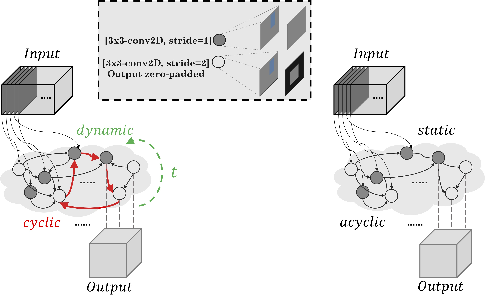

# [Discovering Neural Wirings](https://arxiv.org/abs/1906.00586)

By Mitchell Wortsman, Ali Farhadi and Mohammad Rastegari.


[Preprint](https://arxiv.org/abs/1906.00586) | [Blog](https://mitchellnw.github.io/blog/2019/dnw/) | [BibTex](#citing)



In this work we propose a method for discovering neural wirings.
We relax the typical notion of layers and instead enable channels
to form connections independent of each other.
This allows for a much larger space of possible networks.
The wiring of our network is not fixed during training --
as we learn the network parameters we also learn the structure itself.

## Citing

If you find this project useful in your research, please consider citing:

```
@article{Wortsman2019DiscoveringNW,
  title={Discovering Neural Wirings},
  author={Mitchell Wortsman and Ali Farhadi and Mohammad Rastegari},
  journal={ArXiv},
  year={2019},
  volume={abs/1906.00586}
}
```


## Set Up
0. Clone this repository.
1. Using `python 3.6`, create a `venv` with  `python -m venv venv` and run `source venv/bin/activate`.
2. Install requirements with `pip install -r requirements.txt`.
3. Create a **data directory** `<data-dir>`.
If you wish to run ImageNet experiments there must be a folder `<data-dir>/imagenet`
that contains the ImageNet `train` and `val`. By running experiments on CIFAR-10 a
folder `<data-dir>/cifar10` will automatically be created with the dataset.

## Small Scale Experiments

To test a tiny (41k parameters) classifier on CIFAR-10 in static and dynamic settings, see `apps/small_scale`.
There are 6 experiment files in total -- 3 for random graphs and 3 for discovering neural wirings (DNW).

You may run an experiment with
```bash
python runner.py app:apps/small_scale/<experiment-file> --gpus 0 --data-dir <data-dir>
```

We recommend running the static and discrete time experiments on a single GPU (as above), though you will need to use
multiple GPUs for the continuous time experiments. To do this you may use `--gpus 0 1`.

You should expect the following result:

| Model  | Accuracy (CIFAR-10) |
| :-------------: | :-------------: |
Static (Random Graph) | 76.1 &pm;  0.5|
Static (DNW) | 80.9  &pm;  0.6 |
Discrete Time (Random Graph) | 77.3 &pm;  0.7|
Discrete Time (DNW) | 82.3 &pm;  0.6 |
Continuous (Random Graph) | 78.5  &pm;  1.2  |
Continuous (DNW) | 83.1  &pm;  0.3 |

## ImageNet Experiments and Pretrained Models

The experiment files for the ImageNet experiments in the paper may be found in `apps/large_scale`.
To train your own model you may run
```bash
python runner.py app:apps/large_scale/<experiment-file> --gpus 0 1 2 3 --data-dir <data-dir>
```
and to evaluate a pretrained model which matches the experiment file use.
```bash
python runner.py app:apps/large_scale/<experiment-file> --gpus 0 1 --data-dir <data-dir> --resume <path-to-pretrained-model> --evaluate
```


| Model  | Params | FLOPs | Accuracy (ImageNet) |
| :-------------: | :-------------: | :-------------: | :-------------: |
| [MobileNet V1 (x 0.25)](https://arxiv.org/abs/1704.04861)  |  0.5M  | 41M  | 50.6  |
| [ShuffleNet V2 (x 0.5)](https://arxiv.org/abs/1807.11164)  |  1.4M | 41M  | 60.3 |
| [MobileNet V1 (x 0.5)](https://arxiv.org/abs/1704.04861)  |  1.3M | 149M  | 63.7 |
| [ShuffleNet V2 (x 1)](https://arxiv.org/abs/1807.11164)  |  2.3M | 146M  | 69.4 |
| [MobileNet V1 Random Graph (x 0.225)](https://prior-datasets.s3.us-east-2.amazonaws.com/dnw/pretrained-models/rg_x225.pt)  |  1.2M | 55.7M  | 53.3 |
| [MobileNet V1 DNW Small (x 0.15)](https://prior-datasets.s3.us-east-2.amazonaws.com/dnw/pretrained-models/dnw_small_x15.pt)  |  0.24M | 22.1M  | 50.3 |
| [MobileNet V1 DNW Small (x 0.225)](https://prior-datasets.s3.us-east-2.amazonaws.com/dnw/pretrained-models/dnw_small_x225.pt)  |  0.4M | 41.2M  | 59.9 |
| [MobileNet V1 DNW (x 0.225)](https://prior-datasets.s3.us-east-2.amazonaws.com/dnw/pretrained-models/dnw_x225.pt)  |  1.1M | 42.1M | 60.9 |
| [MobileNet V1 DNW (x 0.3)](https://prior-datasets.s3.us-east-2.amazonaws.com/dnw/pretrained-models/dnw_x3.pt)  | 1.3M | 66.7M | 65.0 |
| [MobileNet V1 Random Graph (x 0.49)](https://prior-datasets.s3.us-east-2.amazonaws.com/dnw/pretrained-models/rg_x49.pt)  |  1.8M | 170M  | 64.1 |
| [MobileNet V1 DNW (x 0.49)](https://prior-datasets.s3.us-east-2.amazonaws.com/dnw/pretrained-models/dnw_x49.pt)  | 1.8M  | 154M  | 70.4 |

You may also add the flag `--fast_eval` to make the model smaller and speed up inference. Adding `--fast_eval` removes the neurons which _die_.
As a result, the first conv, last linear layer, and all operations throughout have much fewer input and output channels. You may add both
`--fast_eval` and `--use_dgl` to obtain a model for evaluation that matches the theoretical FLOPs by using a graph implementation via
[https://www.dgl.ai/](https://www.dgl.ai/). You must then install the version of `dgl` which matches your CUDA and Python version
(see [this](https://www.dgl.ai/pages/start.html) for more details). For example, we run
```bash
pip uninstall dgl
pip install https://s3.us-east-2.amazonaws.com/dgl.ai/wheels/cuda9.2/dgl-0.3-cp36-cp36m-manylinux1_x86_64.whl
```
and finally
```bash
python runner.py app:apps/large_scale/<experiment-file> --gpus 0 --data-dir <data-dir> --resume <path-to-pretrained-model> --evaluate --fast_eval --use_dgl --batch_size 256
```

## Other Methods of Discovering Neural Wirings

To explore other methods of discovering neural wirings see `apps/medium_scale`.

You may run an experiment with
```bash
python runner.py app:apps/medium_scale/<experiment-file> --gpus 0 --data-dir <data-dir>
```

To replicate the one-shot pruning or fine tuning experiments, you must first use `mobilenetv1_complete_graph.yml` to obtain the initialization `init.pt` and the final epoch.  
